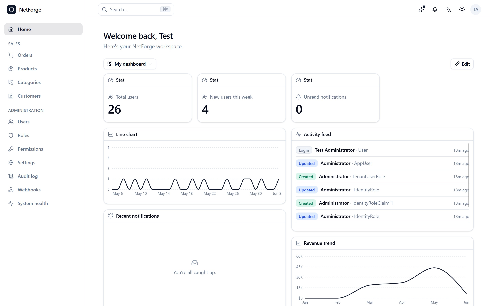
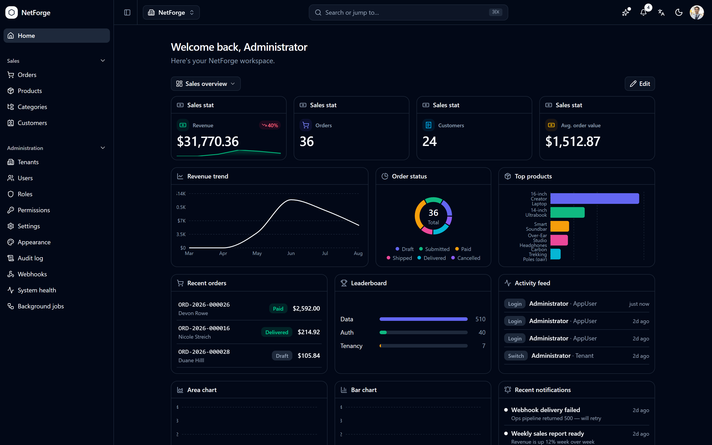
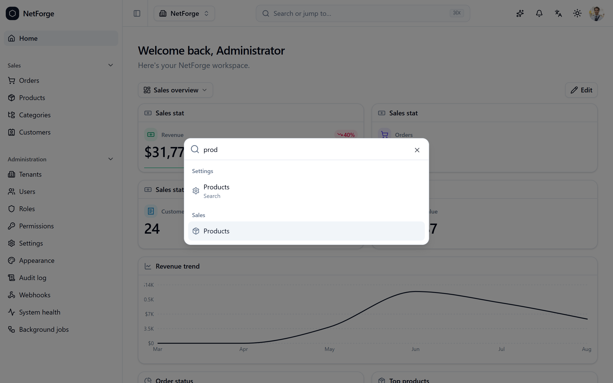
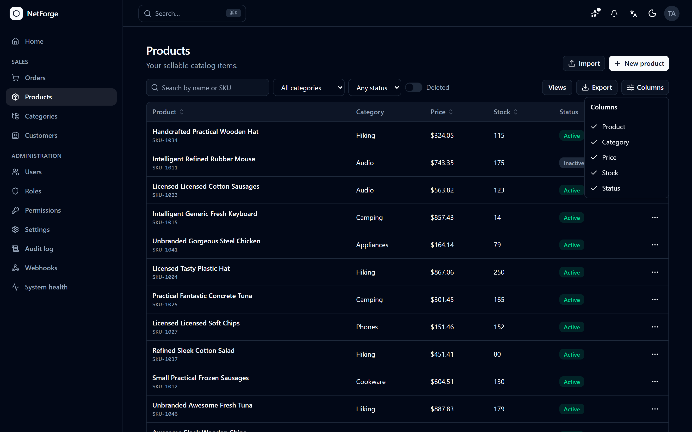
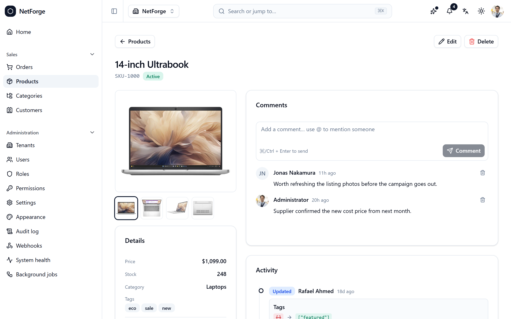
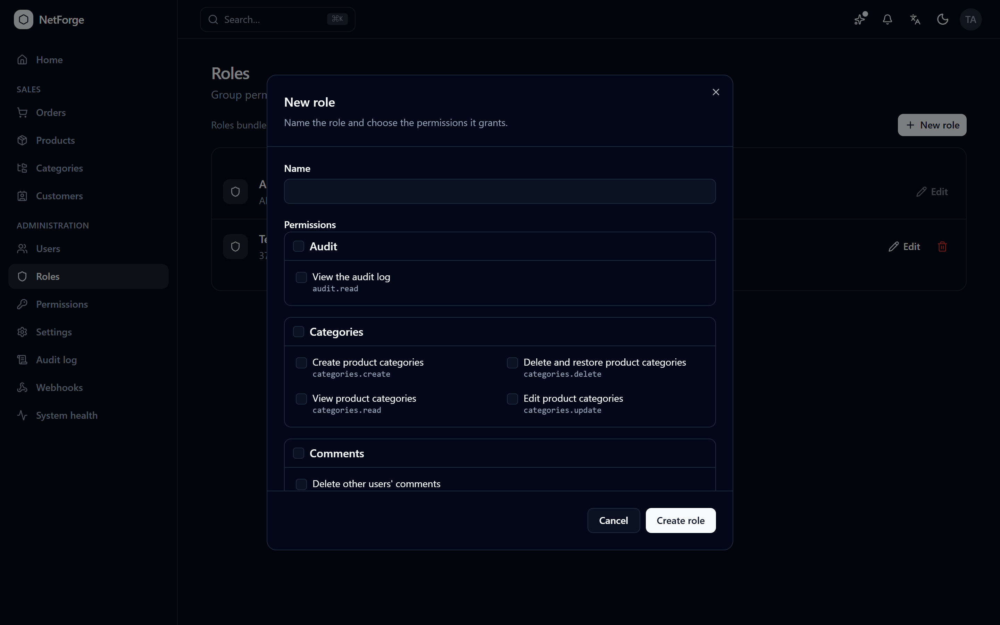
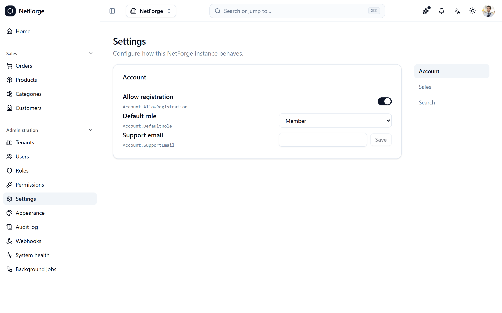
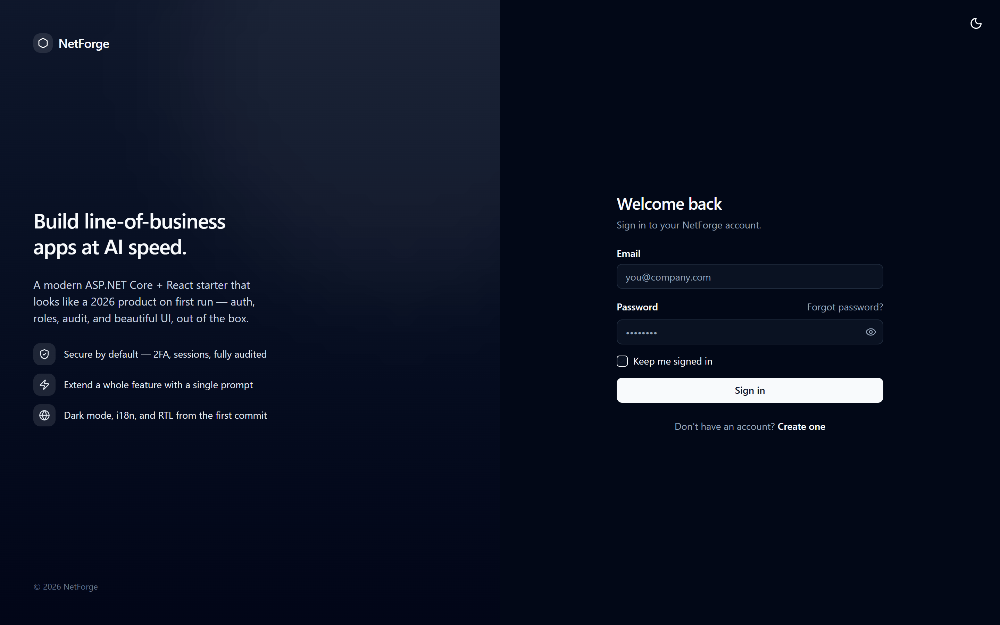
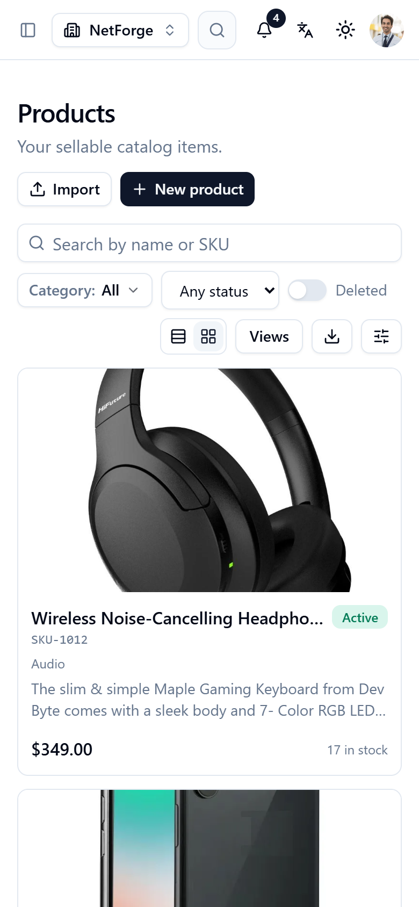

<h1 align="center">NetForge Community</h1>

<p align="center">
  <b>The AI-promptable .NET starter — forged for AI extension, finished by you.</b><br>
  A beautiful-out-of-the-box <b>ASP.NET Core 10 + React 19</b> starter for line-of-business apps. Free and MIT.
</p>

<p align="center">
  <a href="https://demo.netforge.ebenmonney.com"><b>▶ Live demo</b></a> &nbsp;·&nbsp;
  <a href="https://netforge.ebenmonney.com/#configure"><b>⚙ Build your edition</b></a> &nbsp;·&nbsp;
  <a href="https://docs.netforge.ebenmonney.com"><b>📖 Documentation</b></a> &nbsp;·&nbsp;
  <a href="#community-vs-pro"><b>Community vs Pro</b></a>
</p>

<p align="center">
  
  
  
  
  
</p>

---

**NetForge** compresses the first 4–8 weeks of a typical SaaS or internal-tool project into a `git clone`. It's an opinionated, modern alternative to ABP Framework, Clean-Architecture templates, and the generic Visual Studio templates — and it's **built to be a joy to extend**: an **AI assistant can add a feature from a single prompt**, and a developer can reason about the whole codebase without spelunking.

This is the free, **MIT-licensed Community edition**. It's a complete, production-ready single-team starter on its own — auth, RBAC, theming, i18n/RTL, the DataGrid + form layers, and the whole AI-extensible architecture. When your app grows into the product layer most SaaS eventually needs, [**NetForge Pro**](#community-vs-pro) adds it so you don't build it twice.

> **Don't want to build it by hand?** Describe your app in plain language and **NetForge's AI builds it for you** — with a real senior developer backing every build, free with every plan. AI-built or hand-configured, the result is this same standard ASP.NET Core + React/Angular codebase on the database you choose — yours to download and host anywhere, no lock-in. Start at **[netforge.ebenmonney.com/ai](https://netforge.ebenmonney.com/ai)**.

```bash
dotnet run --project NetForge.Server   # SpaProxy auto-starts the React client too
# → https://localhost:3000   ·   admin@netforge.local / Admin123!$
```

---

## See it in action

The screenshots below are the full product (the [**live demo**](https://demo.netforge.ebenmonney.com) runs Pro) — light **and** dark, desktop **and** mobile. The [Community vs Pro](#community-vs-pro) table shows what's in this free edition.



<table>
  <tr>
    <td width="50%"><br><sub><b>Full dark-mode parity</b> — every screen, both themes</sub></td>
    <td width="50%"><br><sub><b>⌘K command palette</b> — global search <sup>(Pro)</sup></sub></td>
  </tr>
  <tr>
    <td><br><sub><b>Server-driven DataGrid</b> — sort, filter, columns, export</sub></td>
    <td><br><sub><b>Detail view</b> — comments + audit timeline <sup>(Pro)</sup></sub></td>
  </tr>
  <tr>
    <td><br><sub><b>Roles &amp; permissions</b> — grouped, wildcard-capable picker</sub></td>
    <td><br><sub><b>Settings</b> — registry-driven, renders itself</sub></td>
  </tr>
</table>

<table>
  <tr>
    <td width="63%"></td>
    <td width="37%"></td>
  </tr>
</table>

---

## Built to be extended — by AI, or by you

This is the differentiator. NetForge's architecture is deliberately uniform, so there's exactly **one** obvious shape to follow — for an AI assistant extending it and for a developer reading the code alike:

- **Backend = vertical slices.** Every feature is six files under `Features/{Domain}/`, auto-registered by reflection. You *never* edit `Program.cs` to add a feature.
- **Frontend = file-system routes.** The folder tree under `src/pages/` *is* the URL tree. No route config to maintain.
- **The conventions are written down** — for agents *and* humans — in `CLAUDE.md` / `AGENTS.md`, `RECIPES.md`, and `CONVENTIONS.md`.

The payoff: a prompt like *"add a Projects feature with CRUD, permissions, and a list page"* lands as idiomatic, reviewable code — because there's a canonical `_Template/` slice to copy and a documented recipe to follow. Hand it to your assistant or write it by hand; either way: **copy the template, follow the recipe, ship the feature.**

---

## Run it

**Prerequisites:** .NET SDK **10.0**, Node.js **20+**, and a trusted dev HTTPS cert (`dotnet dev-certs https --trust`, first run only).

By default, development uses a **self-creating SQLite file** — no database to install. You can scaffold for **PostgreSQL** or **SQL Server** instead (recommended for production) at creation time with `--database postgres|sqlserver` (each ships a `docker-compose.yml` so local dev is still one command), or switch later via the `Database:Provider` setting + connection string.

```bash
dotnet run --project NetForge.Server
```

Open **https://localhost:3000** and sign in with the seeded dev admin (`admin@netforge.local` / `Admin123!$`). First run creates the DB, applies migrations, and seeds an admin.

| Surface | URL |
|---|---|
| **App (use this)** | https://localhost:3000 |
| API | https://localhost:7000 |
| Interactive API docs (Scalar) | https://localhost:7000/scalar *(dev)* |

Full setup + a feature-by-feature tour: **[the documentation](https://docs.netforge.ebenmonney.com)**.

---

## What's in Community

- **Architecture** — vertical-slice backend with reflection-based feature discovery · file-system-routed React frontend · RFC 7807 ProblemDetails everywhere · an `IEndpointFilter` pipeline (validation / performance / transaction).
- **Auth & access** — ASP.NET Identity cookie auth (register · login · email confirm · password reset · profile) · roles + **fine-grained, wildcard-capable permissions**.
- **UX building blocks** — `<DataGrid>` + `useDataGrid` (server sort/filter/search/paging, saved views, mobile cards, bulk actions) · a `<Field>`/`<FormGrid>` form layer · standardized **designed** loading / empty / error states.
- **App shell** — light/dark **theming** · **i18n + RTL** (6 languages) · a settings system that renders its own UI.
- **Production-readiness** — rate limiting · health checks (liveness/readiness) · API versioning · Serilog · seeded admin.
- **SQLite · PostgreSQL · SQL Server** — pick at scaffold time.
- **The `dotnet new` template machinery + `_Template` slices** — the copy-me pattern, ready for your first feature.

---

## Community vs Pro

Community is a complete starter on its own. **Pro** adds the product layer most line-of-business apps eventually need — already built, tested, and held to the same quality bar.

| | Community · MIT | Pro |
|---|:---:|:---:|
| Vertical-slice architecture · DataGrid · forms · ProblemDetails | ✅ | ✅ |
| Cookie auth · RBAC with wildcard permissions | ✅ | ✅ |
| Theming (light/dark) · i18n + RTL · settings | ✅ | ✅ |
| Rate limiting · health checks · API versioning | ✅ | ✅ |
| SQLite · PostgreSQL · SQL Server | ✅ | ✅ |
| Global **⌘K search** | — | ✅ |
| **Audit log** + per-entity activity timeline | — | ✅ |
| **Widget dashboard** — drag/resize, saved layouts | — | ✅ |
| **Webhooks** — HMAC-signed, retried delivery | — | ✅ |
| **Real-time notifications** (SignalR) | — | ✅ |
| **Multi-tenancy** — per-tenant RBAC, branding, invitations | — | ✅ |
| **2FA · OAuth** (Google/Microsoft/GitHub) **· sessions · Bearer mode** | — | ✅ |
| **File uploads** + image processing | — | ✅ |
| **CSV / Excel / PDF** export + import | — | ✅ |
| Runtime **appearance customizer** | — | ✅ |
| **PWA** · onboarding tour · in-app changelog | — | ✅ |
| Entity **comments + @mentions** | — | ✅ |
| **Sales demo domain** — a full vertical reference slice | — | ✅ |
| The **configurator** — toggle every feature at scaffold time | — | ✅ |

<p align="center">
  <b><a href="https://demo.netforge.ebenmonney.com">Try the full app live →</a></b> &nbsp;&nbsp;|&nbsp;&nbsp;
  <b><a href="https://netforge.ebenmonney.com/#configure">Build & download your exact edition →</a></b>
</p>

The configurator lets you choose precisely the features you want — turn any Pro subsystem on or off and get a ready-to-run project.

---

## Architecture in five bullets

1. **Backend vertical slices** under `Features/{Domain}/` — six files each, auto-registered by reflection. **Never edit `Program.cs` to add a feature.**
2. **Frontend file-system routes** under `src/pages/` — the path tree *is* the URL tree. `_`-prefixed = ignored by the router.
3. **Errors** = RFC 7807 ProblemDetails, always. Throw a `DomainException` subclass — never a raw `Exception`.
4. **Lists** = `PagedRequest`/`PagedResult<T>` with operator-suffix query syntax (`?price=gte:10&sort=name:asc`).
5. **Cross-cutting concerns** = the `IEndpointFilter` pipeline, not per-handler wiring.

Copy `Features/_Template/` (backend) or `src/pages/_template/` (frontend) to start anything — the scaffolding *is* the canonical shape.

---

## The quality bar (non-negotiable)

A feature isn't done until all six are true: a **designed loading state** (skeleton, not a spinner) · **designed empty state** · **designed error state** (plain language + Retry + traceId) · **mobile layout verified** · **dark-mode parity verified** · **keyboard navigation verified**. Fewer features at higher quality, not the reverse.

---

## Documentation

Everything lives at **[docs.netforge.ebenmonney.com](https://docs.netforge.ebenmonney.com)** — the user guide, copy-pasteable recipes (add a feature / widget / webhook), the conventions cheat-sheet, and the editions breakdown. The same guides ship in this repo under [`docs/`](docs/), and the AI-agent guidance is in [`CLAUDE.md`](CLAUDE.md) / [`AGENTS.md`](AGENTS.md).

---

## Stack

- **Backend:** .NET 10 · Minimal APIs · EF Core 10 · ASP.NET Identity · FluentValidation · Serilog · Scalar (API docs) · MailKit
- **Frontend:** React 19 · Vite 8 · TypeScript 6 · Tailwind v4 · shadcn/ui · React Router 7 (file-system routes) · TanStack Query · Zustand · React Hook Form + Zod
- **DB:** SQLite (dev default) · PostgreSQL · SQL Server
- **Tests:** xUnit v3 · Shouldly · NSubstitute · `WebApplicationFactory`

---

## License

NetForge Community is released under the [**MIT License**](LICENSE) — use it freely, including in commercial and closed-source products. NetForge **Pro** is a separate commercial edition; see [Community vs Pro](#community-vs-pro) and [netforge.ebenmonney.com](https://netforge.ebenmonney.com).
